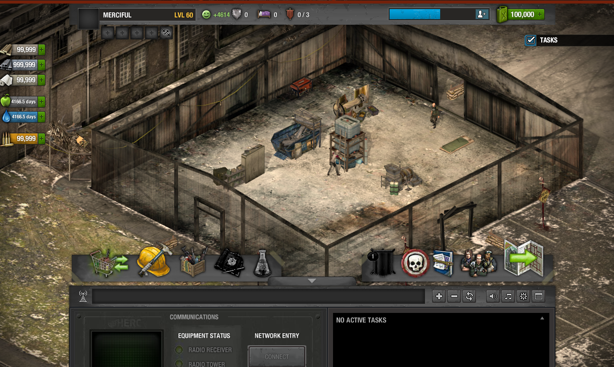

## TLSDZ Documentation

Effort to create The Last Stand: Dead Zone private server. Document everything we know about the game.

- [DeadZone-Private-Server on GitHub](https://github.com/SulivanM/DeadZone-Private-Server)
- [DeadZone-Documentation on GitHub](https://github.com/glennhenry/DeadZone-Documentation)

TLSDZ uses [PlayerIO backend service](https://playerio.com/). Our task is to design a server that response to the game request including making services that mimics PlayerIO backend.

## Our Progress



We are already in the game.

- Loaded compound successfully
- Items are sent from server to game
- Can enter mission, though not finishing it

### What's Next?

You can help the development of the private server directly by making a change in the server code. You can also help us investigate, write helpful found, and let others develop the server.

Our general principle is:

1. Try to reach the point that our server is currently stuck at.
2. Investigate what is wrong and figure out what changes should be made to the server to progress further.
3. Document your findings or implement changes directly on the private server. Your finding may involve details about a specific piece of code, game packages or class, the game expected behavior without error, request or response specification, a known server issues, or possible solutions.
4. Repeat the process.

See [preloader](/preloader-main) and [core](/core-main) to know how the game works sequentially. Checkout the GitHub issues for the private server or ask questions away in our [Discord](https://discord.gg/Q5dTKrPmfq).

### Current Investigation

Since we are already in the game, the next task isn't specific to doing something. Feel free to explore the game and test if anything is wrong.

Basically: do something > if there is an error or something unintended > fix it.

:::note
We skipped survivor creation because we provided survivors data. Not doing so results in null error. We are also skipping tutorial to skip the hassle of implementing it.
:::

### How to Debug

There are four ways to debug (the four is easiest):

1. After connected to socket server, client errors are sent to the server through [API 50](/api-server#api-50). In our private server, these errors are logged in `write_error.log`. This is particularly helpful for debugging, as the flash debugger does not always report errors. Additionally, you can modify the SWF to intentionally trigger an error (by `throw`), which will help you trace the issue.
2. `Logch` is command is also useful to send log to the console of the game (can be activated by pressing `=`). Log command can be written like `Cc.logch("<identifier>", "<logmsg>")`.
3. Using `trace` of AS3. You will need to place `mm.cfg` in flash folder of your computer. You will also need flash debug plugin. Logs are written to `flashlogs.txt`. I haven't been able to log via this method, so you must search yourself the detail.
4. This is the most flexible way to debug. Another way is calling `console.log` of browser via `flash.external.ExternalInterface`. You can do this by importing the mentioned package and create this function:

```
public function log(msg: String): void {
    ExternalInterface.call("console.log", msg);
}

and call this function by: `log("message logged:" + optionalVariable)`
```

So you would decompile the `core.swf`, add the said function and logging, then recompile it.
